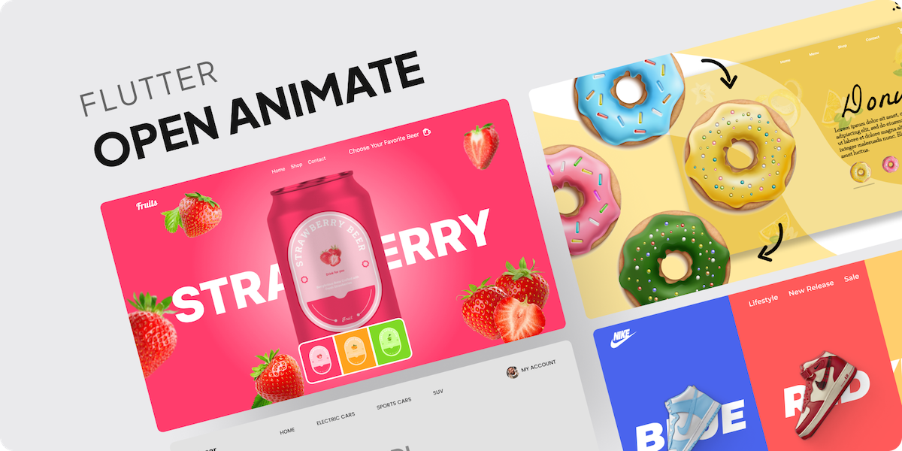
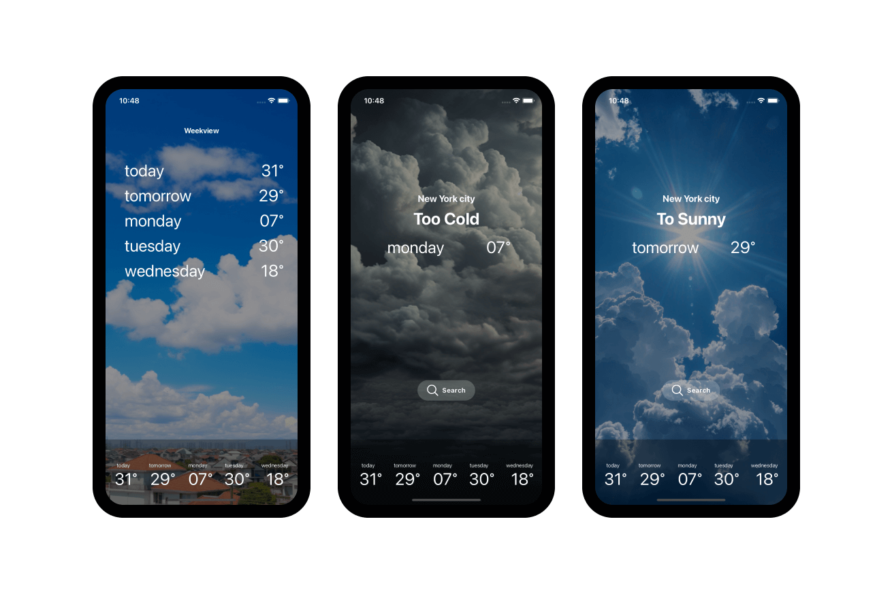
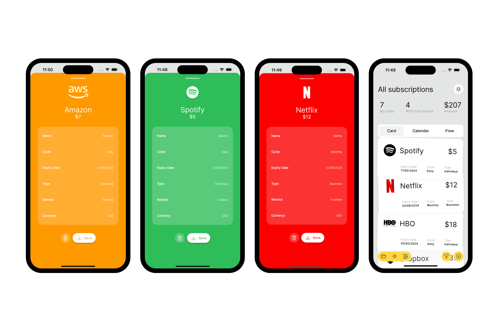
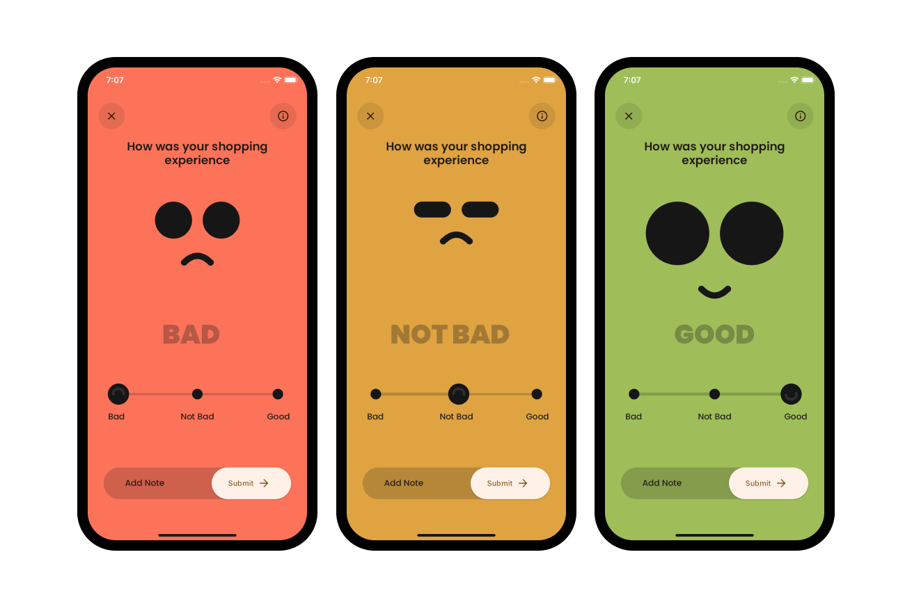
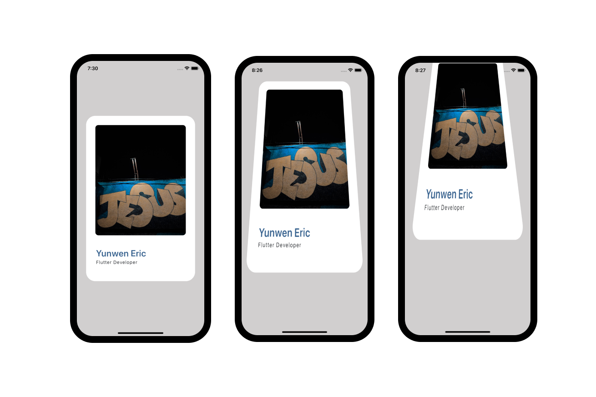
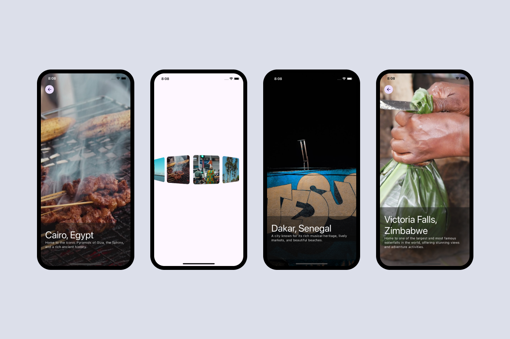
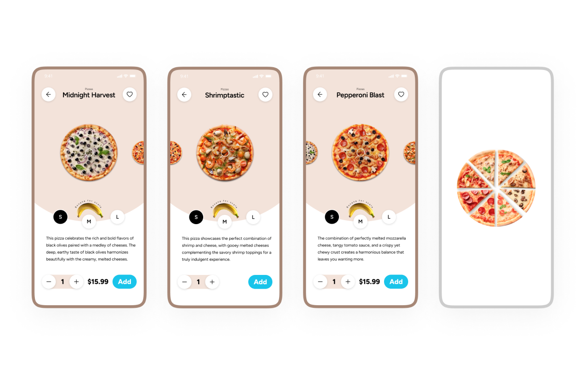
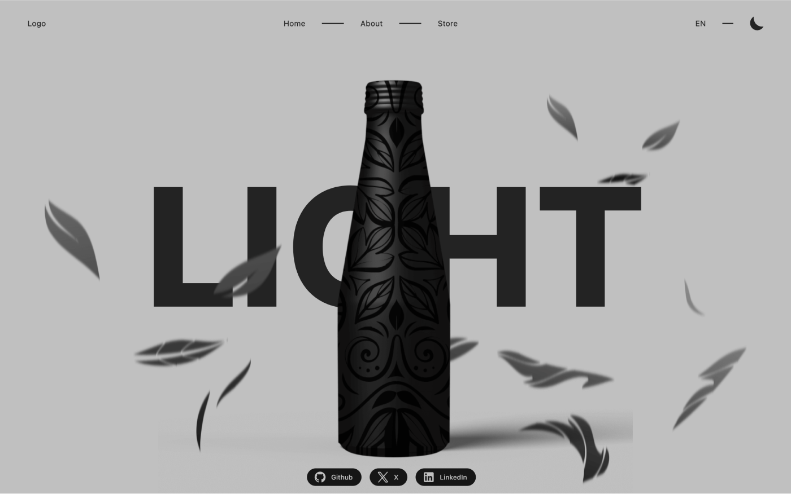
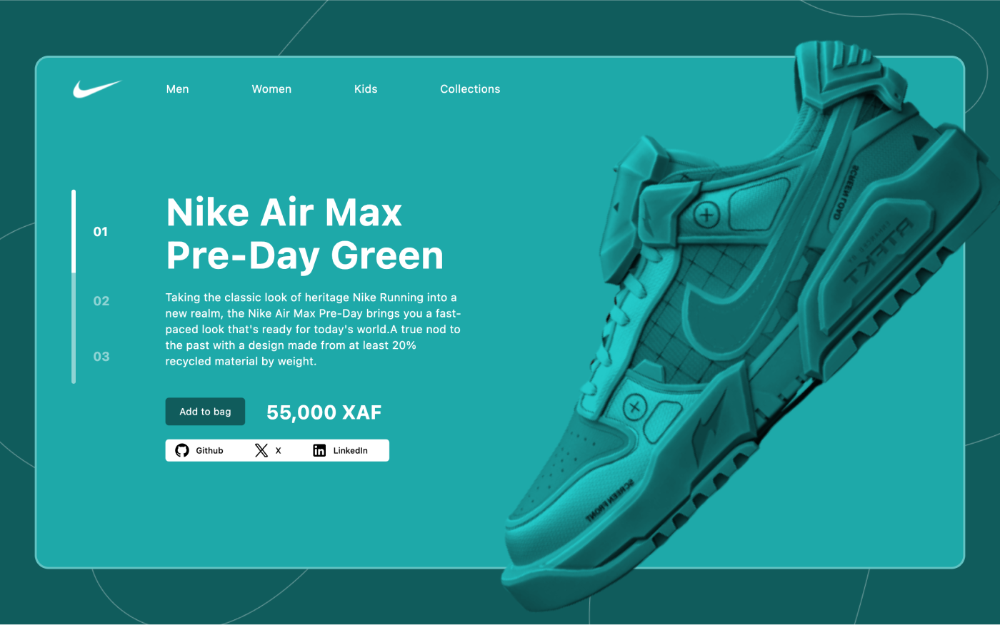
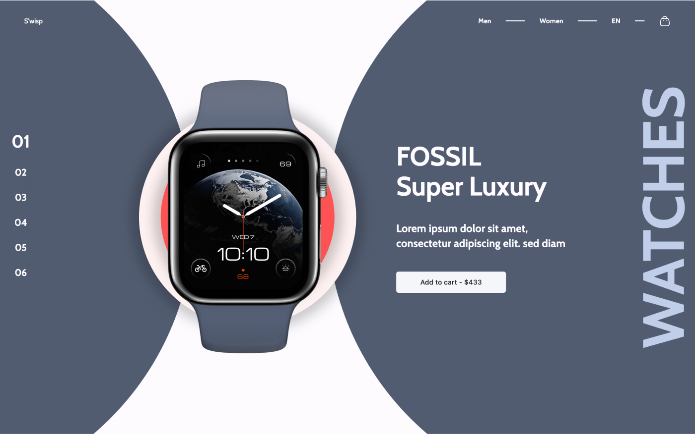

# Flutter Open UIs for your projects!

<table>
    <tr>
        <td>
          
        </td>
        <td>
        
        </td>
    </tr>

</table>

Flutter open-source project that's all about pushing the boundaries of User Interfaces! 🌟✨ If you're a Flutter enthusiast or just someone who appreciates stunning UI/UX, this project is tailor-made for you! 🚀🎨

## Setup guide

- Install and use [Fvm](https://fvm.app/) to manage your flutter version

- Specify your fvm version

  ```
  fvm use 3.xx
  ```

- Get your dependencies
  ```
   flutter pub get
  ```

## Contribution guide

To contribute to this repo,

- Fork the repo
- Check out to the `main`. This branch is the simple `flutter counter app`
- Create your own branch from the `main` branch
- (Optional) Change your flutter version using fvm

  ```
  fvm use 3.xx
  ```

- You can learn how to use fvm here [How to use Fvm](https://fvm.app/)

- Create your mockups
- Add your mockup image in the `showcase` folder. You can use this [Figma](https://www.figma.com/design/UkbKjgmGzKFubnmE9VO2IL/Flutter-Open-UI?t=1Rp4VYHVXIp8manu-1) to do your mockup images

- Add all your changes
  ```
  git add .
  ```
- Commit your changes

  ```
  git commit -m 'proper commit message'
  ```

- Push your changes to your branch

  ```
  git push origin branch_name
  ```

- Make a pull request to the `contribution` branch.

## Gallery

<table>
<table>
  <tr>
        <td>
            <a href="https://github.com/yunweneric/flutter_openUI/tree/weather_app">
                
            </a>
        </td>
        <td>
            <a href="https://github.com/yunweneric/flutter_openUI/tree/manage_subscriptions">
                
            </a>
        </td>
    </tr>
  <tr>
        <td>
            <a href="https://github.com/yunweneric/flutter_openUI/tree/leave_a_review">
                
            </a>
        </td>
        <td>
            <a href="https://github.com/yunweneric/flutter_openUI/tree/shrink_slide_card">
                
            </a>
        </td>
    </tr>
    <tr>
        <td>
            <a href="https://github.com/yunweneric/flutter_openUI/tree/circle_carousel">
                
            </a>
        </td>
        <td>
            <a href="https://github.com/yunweneric/flutter_openUI/tree/pizza_mobile">
                
            </a>
        </td>
    </tr>
    <tr>
        <td>
            <a href="https://github.com/yunweneric/flutter_openUI/tree/fruity_lips">
                
            </a>
        </td>
        <td>
            <a href="https://github.com/yunweneric/flutter_openUI/tree/fashion_shop">
                
            </a>
        </td>
    </tr>
    <tr>
        <td>
            <a href="https://github.com/yunweneric/flutter_openUI/tree/car_shop_slider">
                
            </a>
        </td>
        <td>
            <a href="https://github.com/yunweneric/flutter_openUI/tree/animated_fruit_carousel">
                
            </a>
        </td>
    </tr>
    <tr>
        <td>
            <a href="">
                
            </a>
        </td>
        <td>
            <a href="">
                
            </a>
        </td>
    </tr>
    <tr>
        <td>
            <a href="https://github.com/yunweneric/flutter_openUI/tree/animated_bottle_theming">
                
            </a>
        </td>
        <td>
            <a href="https://github.com/yunweneric/flutter_openUI/tree/nike_shop">
                
            </a>
        </td>
    </tr>
    <tr>
        <td>
            <a href="https://github.com/yunweneric/flutter_openUI/tree/authUI02">
                
            </a>
        </td>
        <td>
            <a href="https://github.com/yunweneric/flutter_openUI/tree/authUI01">
                
            </a>
        </td>
    </tr>
    <tr>
        <td>
            <a href="https://github.com/yunweneric/flutter_openUI/tree/animated_watch_shop">
                
            </a>
        </td>
        <td>
            <a href="https://github.com/yunweneric/flutter_openUI/tree/doughnut_shop">
                
            </a>
        </td>
    </tr>
     <tr>
        <td>
            <a href="https://github.com/yunweneric/flutter_openUI/tree/nike_zoomer">
                
            </a>
        </td>
        <td>
            <a href="https://github.com/yunweneric/flutter_openUI/tree/pet_onboarding_ui">
                
            </a>
        </td>
    </tr>
    <tr>
        <td>
            <a href="https://github.com/yunweneric/flutter_openUI/tree/Onboarding_01">
                
            </a>
        </td>
        <td>
            <a href="https://github.com/yunweneric/flutter_openUI/tree/nat_geo_carousel">
                
            </a>
        </td>
    </tr>

</table>
