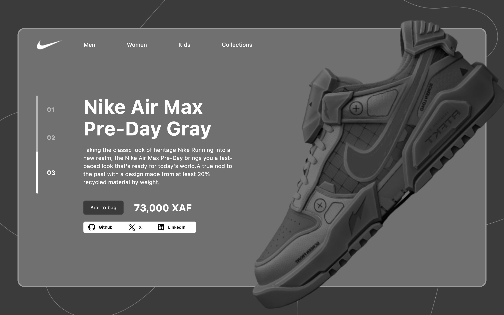
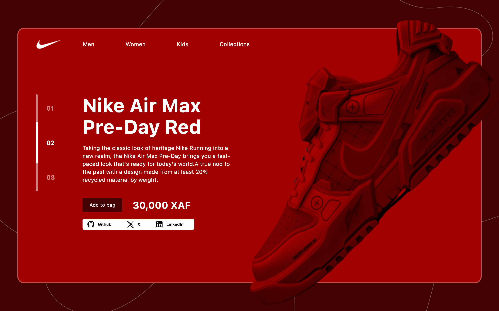
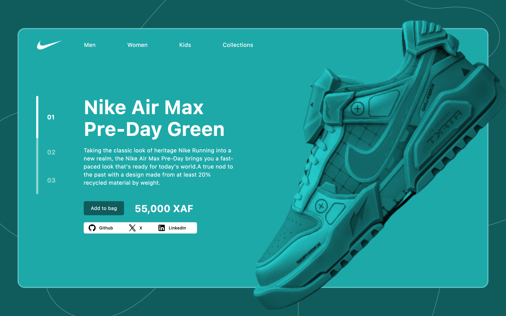

### Getting Started

An amazing UI Design from figma community. Done with Flutter

```bash
flutter pub get
flutter run
```

- [Figma File ](<https://www.figma.com/design/yog6rgpR041fByY9ygaVCE/Nike-Landing-Page-Concept-(Community)?node-id=1-46&t=CdDmMrtrHm4SESwf-0>)

- [Demo Link](https://flutternikeshop.netlify.app/)

A few resources to get you started if this is your first Flutter project:

- [Lab: Write your first Flutter app](https://docs.flutter.dev/get-started/codelab)
- [Cookbook: Useful Flutter samples](https://docs.flutter.dev/cookbook)

For help getting started with Flutter development, view the
[online documentation](https://docs.flutter.dev/), which offers tutorials,
samples, guidance on mobile development, and a full API reference.

## Gallery

<table>
  <tr>
    <td>
      <a href="https://github.com/yunweneric/flutter_openUI/tree/authUI02">
        
      </a>
    </td>
     <td>
      <a href="https://github.com/yunweneric/flutter_openUI/tree/authUI01">
        
      </a>
    </td>
   
   
  </tr>
     <td>
      <a href="https://github.com/yunweneric/flutter_openUI/tree/Onboarding_01">
        
      </a>
    </td>
  <td> </td>
    
   
  </tr>

</table>
