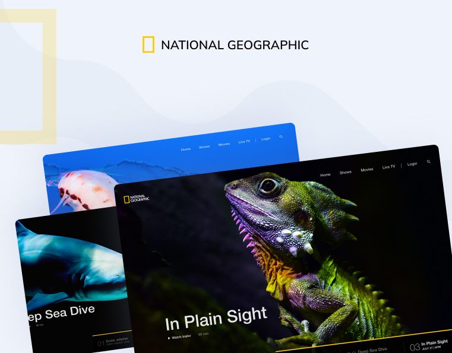

### Getting Started

An amazing UI Design from figma community. Done with Flutter

```bash
flutter pub get
flutter run
```

- [Figma File ](<https://www.figma.com/design/Sn883J01rFsGdS14wujOGz/Intro-Slider-Effect-Animation-di-Figma-(Community)?node-id=0%3A1&t=xnD31wuPmzp6nC0g-1>)
  o
- [Demo Link](https://flutter-nike-animation.netlify.app/)

A few resources to get you started if this is your first Flutter project:

- [Lab: Write your first Flutter app](https://docs.flutter.dev/get-started/codelab)
- [Cookbook: Useful Flutter samples](https://docs.flutter.dev/cookbook)

For help getting started with Flutter development, view the
[online documentation](https://docs.flutter.dev/), which offers tutorials,
samples, guidance on mobile development, and a full API reference.


