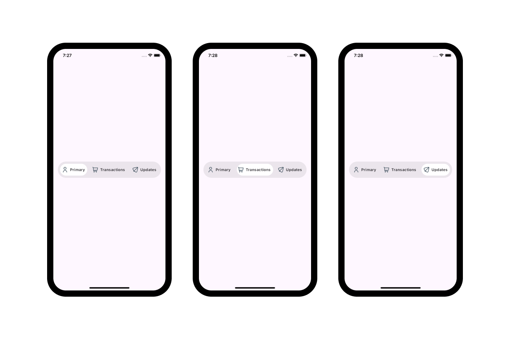

# Flutter Open UIs for your projects!

<table>
    <tr>
        <td>
          
        </td>
        <td>
        
        </td>
    </tr>

</table>

Flutter open-source project that's all about pushing the boundaries of User Interfaces! 🌟✨ If you're a Flutter enthusiast or just someone who appreciates stunning UI/UX, this project is tailor-made for you! 🚀🎨

## Setup guide

- Install and use [Fvm](https://fvm.app/) to manage your flutter version

- Specify your fvm version

  ```
  fvm use 3.xx
  ```

- Get your dependencies
  ```
   flutter pub get
  ```

## Contribution guide

To contribute to this repo,

- Fork the repo
- Check out to the `main`. This branch is the simple `flutter counter app`
- Create your own branch from the `main` branch
- (Optional) Change your flutter version using fvm

  ```
  fvm use 3.xx
  ```

- You can learn how to use fvm here [How to use Fvm](https://fvm.app/)

- Create your mockups
- Add your mockup image in the `showcase` folder. You can use this [Figma](https://www.figma.com/design/UkbKjgmGzKFubnmE9VO2IL/Flutter-Open-UI?t=1Rp4VYHVXIp8manu-1) to do your mockup images

- Add all your changes
  ```
  git add .
  ```
- Commit your changes

  ```
  git commit -m 'proper commit message'
  ```

- Push your changes to your branch

  ```
  git push origin branch_name
  ```

- Make a pull request to the `contribution` branch.

## Gallery


