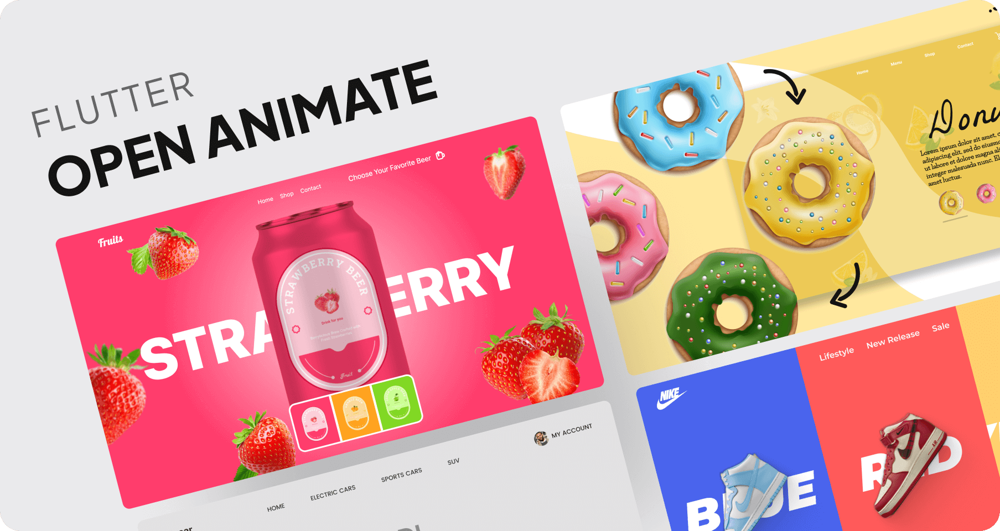

# Flutter Open UIs for your projects!



Flutter animated open-source project that's all about pushing the boundaries of User Interfaces! 🌟✨ If you're a Flutter enthusiast or just someone who appreciates stunning UI/UX, this project is tailor-made for you! 🚀🎨

## Setup guide

- Install and use [Fvm](https://fvm.app/) to manage your flutter version

- Specify your fvm version

  ```
  fvm use 3.xx
  ```

- Get your dependencies
  ```
   flutter pub get
  ```

## Contribution guide

To contribute to this repo,

- Fork the repo
- Check out to the `starter_app`. This branch is the simple `flutter counter app`
- Create your own branch from the `starter_app` branch
- Make sure the branch name follows the numbering ex: AuthUI01, AuthUI02, AuthUI03, OnboardingUI01 ...
- Change your flutter version using fvm

  ```
  fvm use 3.xx
  ```

- You can learn how to use fvm here [How to use Fvm](https://fvm.app/)

- Create your mockup and add it in the assets/showcase folder
- Add all your changes
  ```
  git add .
  ```
- Commit your changes

  ```

  git commit -m 'proper commit message'
  ```

- Push your changes to your branch

  ```
  git push origin branch_name
  ```

- Make a pull request to the `contribution` branch.

## Gallery

<table>
  <tr>
    <td>
      <a href="https://github.com/yunweneric/flutter-open-animate/tree/doughnut_shop">
        
      </a>
    </td>
     <td>
      <a href="https://github.com/yunweneric/flutter-open-animate/tree/nike_slider">
        
      </a>
    </td>
   
   
  </tr>
    <td>
      <a href="https://github.com/yunweneric/flutter-open-animate/tree/fruits_animation">
        
      </a>
    </td>
     <td>
      <a href="https://github.com/yunweneric/flutter-open-animate/tree/car_rental">
        
      </a>
    </td>

  </tr>

</table>
