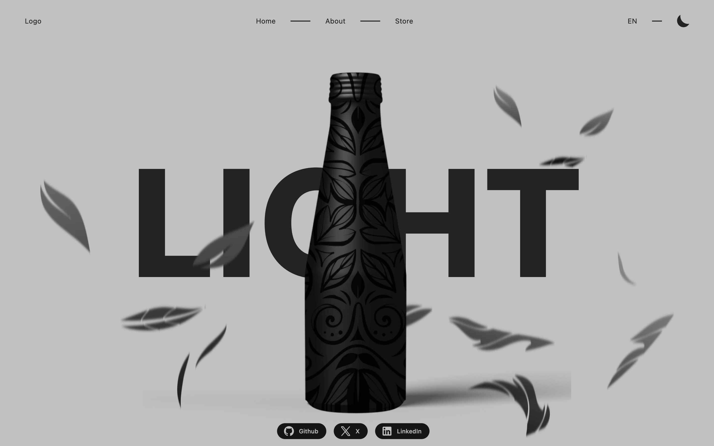
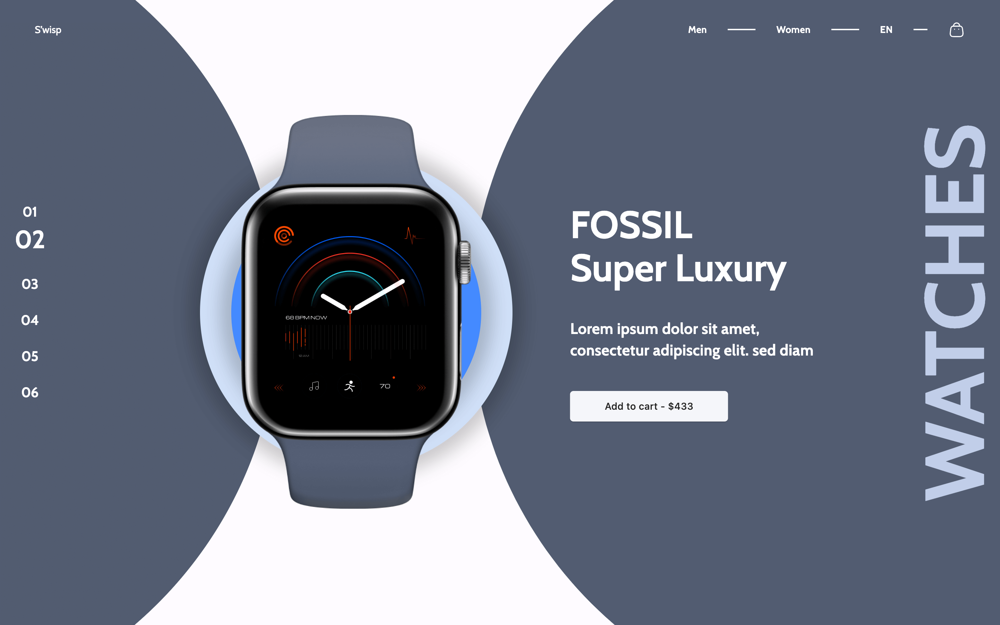
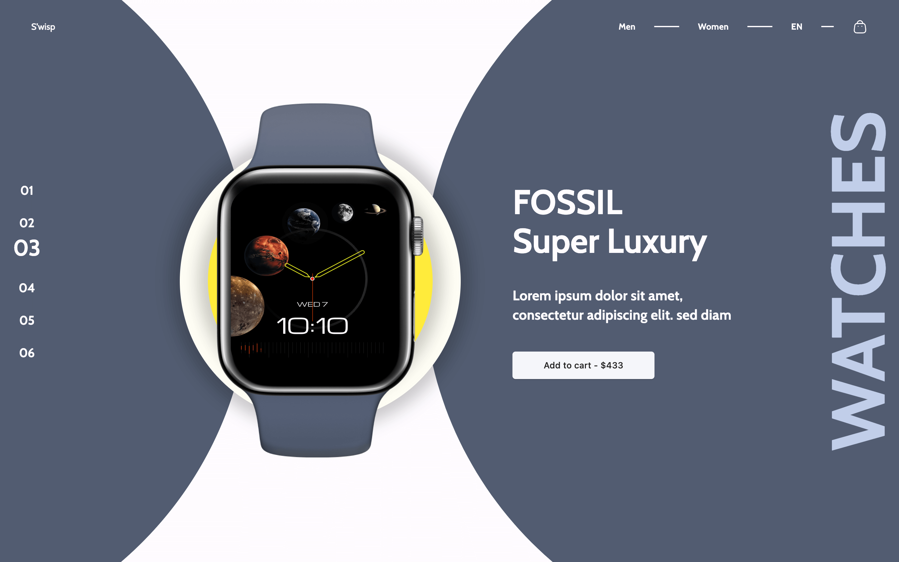
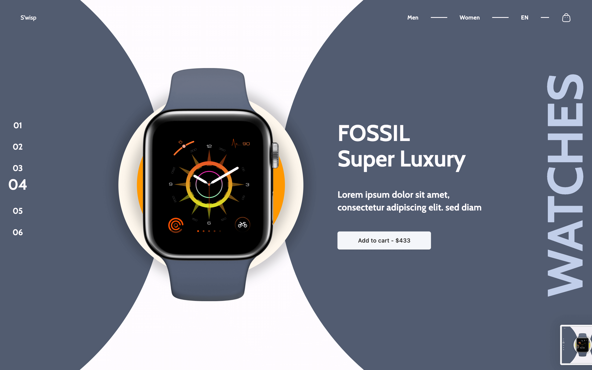
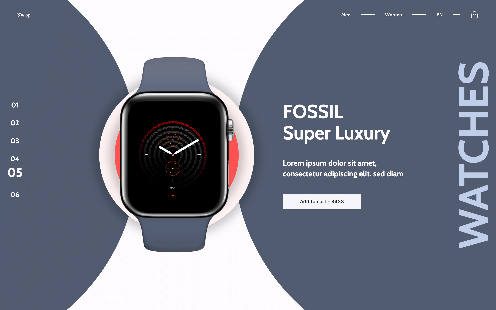

### Getting Started

An amazing UI Design from figma community. Done with Flutter

```bash
flutter pub get
flutter run
```

- [Figma File ](<https://www.figma.com/design/qo3m6wj7JS6q5Dp4bGCt8Y/Fossil-Watch-Modern-Web-Landing-Page-Example-%7C-Web-Design-(Community)?m=auto&t=CXvbB2LIjHryG63w-6>)

- [Demo Link](https://flutterwatchstore.netlify.app/)

A few resources to get you started if this is your first Flutter project:

- [Lab: Write your first Flutter app](https://docs.flutter.dev/get-started/codelab)
- [Cookbook: Useful Flutter samples](https://docs.flutter.dev/cookbook)

For help getting started with Flutter development, view the
[online documentation](https://docs.flutter.dev/), which offers tutorials,
samples, guidance on mobile development, and a full API reference.

## Gallery


<!-- 
<table>
  <tr>
    <td>
      <a href="#">
        
      </a>
    </td>
     <td>
      <a href="#">
        
      </a>
    </td>
   
   
  </tr>
     <td>
      <a href="#">
        
      </a>
    </td>
     <td>
      <a href="#">
        
      </a>
    </td>

  </tr>
    </tr>
     <td>
      <a href="#">
        
      </a>
    </td>
     <td>
      <a href="#">
        
      </a>
    </td>

  </tr>

</table> -->
